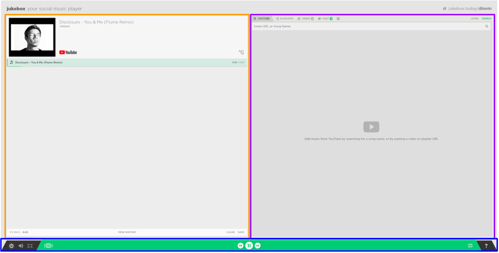
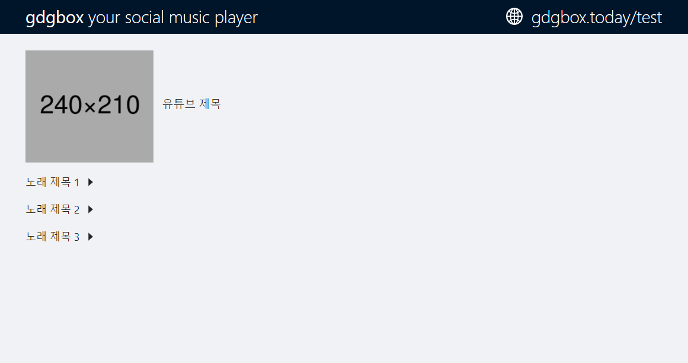
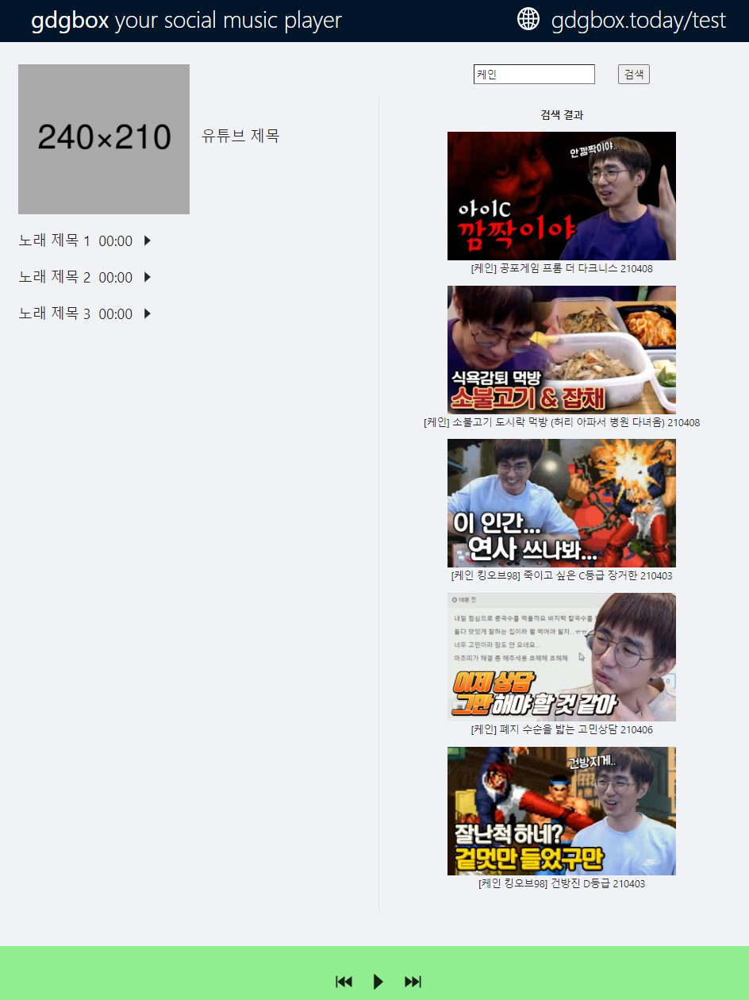

# 레이아웃 제작
  
레이아웃을 제작하기 위해  
기존 주크박스 홈페이지의 레이아웃을 참고하였다

헤더는 현재 서비스 이름 및 현재 접속한 URL 표시

컨텐츠의 좌측에는 현재 재생되는 노래의 큐 표시

컨텐츠의 우측에는 노래 검색창 및 검색 결과창 표시

하단에는 컨트롤 바가 표시된다

ant design css 프레임워크를 사용하여  
전반적인 기본 디자인을 상속받았다

컨텐츠의 레이아웃은 css flexbox 기능을 사용하여  
제작하였다

유튜브 API 기능을 사용하여 만든 검색 컴포넌트를  
우측에 배치하여 위의 주크박스 레이아웃과 비슷하게  
제작해보았다 
