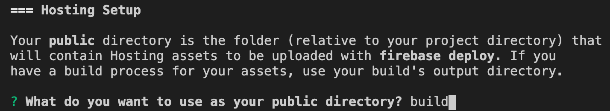

# 1편 - 파이어베이스 초기화 및 웹앱 호스팅

## Create React App으로 프로젝트 생성

`create-react-app 앱이름`

> 여기서 Typescript 템플릿 적용은  
> `create-react-app 앱이름 --template typescript`

> 여기서 패키지매니저를 npm으로 바꾸는 것은  
> `create-react-app 앱이름 --use-npm`

프로젝트 생성 결과

```
├── README.md
├── package-lock.json
├── package.json
├── public
│   ├── favicon.ico
│   ├── index.html
│   ├── logo192.png
│   ├── logo512.png
│   ├── manifest.json
│   └── robots.txt
├── src
│   ├── App.css
│   ├── App.test.tsx
│   ├── App.tsx
│   ├── index.css
│   ├── index.tsx
│   ├── logo.svg
│   ├── react-app-env.d.ts
│   ├── reportWebVitals.ts
│   └── setupTests.ts
└── tsconfig.json
```

> typescript 템플릿으로 생성한 프로젝트 구조

---

## 파이어베이스 설치

이제 프로젝트를 구성했으니 파이어베이스 프로젝트로 전환해야한다

### 파이어베이스 프로젝트 생성

`https://console.firebase.google.com/`  
해당 사이트로 이동한다


프로젝트 추가 클릭


프로젝트 제목 정하고


현 프로젝트에는 애널리틱스를 포함하지 않기 때문에 체크 취소 후 프로젝트 생성


프로젝트 생성 후 나오는 페이지에서 상단의 </> 버튼을 클릭


웹앱 이름을 지정한다


다음버튼을 누른다


`npm install -g firebase-tools`로 파이어베이스 툴을 설치한다


`firebase login` 입력하고 google 계정으로 로그인한다  
그리고 콘솔로 이동을 누른다

### 기존프로젝트에 Firebase 프로젝트 생성


`firebase init` 입력 후
해당 cli 화면에서 Firestore, Functions, Hosting, Storage, Emulators 선택을 한다

> 현재 무료 요금제이면 Functions를 체크 해제한다  
> (무료 요금제는 사용불가능)

Use an Existing Project 선택 후 현 firebase 프로젝트 이름 선택 후 넘어간다

> init가 제대로 실행이 안된다면 firestore 초기화를 위해 Firebase콘솔에서  
> 왼쪽의 네비게이션 클릭후 Firestore탭에서 시작하기 버튼을 클릭
>   
> 현 화면에서 테스트 모드 클릭 후 다음으로 넘어가고 그 뒤 리전을 설정하고 마무리 한다

### Firestore 설정

  
init 중 firestore rules, indexes 파일의 이름을 물어보는데 엔터를 입력해서 넘어가자 (기본값)

### Functions 설정

> 무료요금제는 사용할 수 없기 때문에 넘어간다

또한 Functions의 기본 언어를 묻는데 js, ts중 고른다
그 다음은 eslint 사용 여부에 따라 고른다

> 루트 프로젝트에서 eslint를 사용하고 있다면 No 로 고른다  
> vscode에서 서브 프로젝트의 eslint를 제대로 파악못하는 버그가 있다

그리고 엔터 누르고 마친다

### Hosting 설정

  
호스팅할 폴더를 선택해야한다 기본값은 public으로 되어있지만 spa웹앱을 만들것이기 때문에 build 폴더로 지정한다

  
그 다음 에뮬레이터 설정에서 Database 제외하고 전부 선택하고 전부 기본포트로 설정한다

이제 firebase와 프로젝트가 연동되었다

```
├── README.md
├── build
│   └── index.html
├── firebase.json
├── firestore.indexes.json
├── firestore.rules
├── functions
│   ├── package-lock.json
│   ├── package.json
│   ├── src
│   │   └── index.ts
│   ├── tsconfig.dev.json
│   └── tsconfig.json
├── package-lock.json
├── package.json
├── public
│   ├── favicon.ico
│   ├── index.html
│   ├── logo192.png
│   ├── logo512.png
│   ├── manifest.json
│   └── robots.txt
├── src
│   ├── App.css
│   ├── App.test.tsx
│   ├── App.tsx
│   ├── index.css
│   ├── index.tsx
│   ├── logo.svg
│   ├── react-app-env.d.ts
│   ├── reportWebVitals.ts
│   └── setupTests.ts
└── tsconfig.json
```

현 프로젝트를 github repo에 커밋한다

---

## 빌드 및 배포

CRA로 프로젝트가 구성이 되어있다면 `npm run build` 로 빌드한다
그 후 `firebase deploy` 명령어로 배포한다

  
파이어베이스 콘솔에서 Hosting으로 들어간다

  
상단의 주소를 클릭하면 deploy된 웹앱이 보일것이다


## Firebase와 웹앱 연결

파이어베이스 서버와 웹앱을 연동하기 위해서는
먼저 현 프로젝트 폴더에서 `npm install --save firebase`로 firebase 종속성을 설치한다

  
그리고 콘솔에서 여기를 클릭한다음

  
페이지 하단에서 config 스니펫을 복사한다

그리고 `index.tsx`에서 아래 내용을 추가한다

```js
import firebase from 'firebase/app';

import 'firebase/auth';
import 'firebase/firestore';
//...
const firebaseConfig = {
  // 아까 복사한 스니펫
};
firebase.initializeApp(firebaseConfig);
```

`deploy`까지 하면 웹앱과 파이어베이스가 연동된것이다

## 로컬 통합 테스트

로컬에서 웹앱의 hot reloading 기능을 사용하면서 테스트 하려면
`npm run start`로 시작을 한다

하지만 Firebase를 실제 서버가 아닌 로컬 서버로 테스트 하기위해
Firebase emulator를 실행해야한다

현 프로젝트의 `package.json`에서

```
"scripts": {
    ...
    "deploy": "npm run build && firebase deploy",
    "serve": "yarn build && firebase emulators:start",
    "serveb": "firebase emulators:start --only firestore,auth,functions,pubsub --import emulator-backup",
    "backup": "firebase emulators:export ./emulator-backup"
  },
```

script 항목에서 4줄을 추가해준다  
`deploy`: 자동으로 빌드 후 deploy하게 해준다  
`serve`: 실제서버에서 돌아가는 것처럼 에뮬레이팅 한다  
`serveb`: hosting만 에뮬레이팅 하지 않는다, auth와 firestore의 백업데이터를 이용하여 시작한다  
`backup`: 실행중인 에뮬레이터의 auth와 firestore의 데이터를 백업한다

`index.tsx`에서 firebase초기화문 아래에 밑의 스니펫을 붙여넣는다

```js
//...
// 주소가 localhost 일 때 firestore 테스트모드
if (window.location.hostname === 'localhost') {
  console.log('INFO - running in localhost');
  firebase.auth().useEmulator('http://localhost:9099/');
  firebase.firestore().useEmulator('localhost', 8080);
}
```

아래 스니펫은 현재 접속된 호스트주소가 localhost일때  
실제 서버대신 에뮬레이터 서버에 접속하는 구문이다

### 끝났다!

이제 `npm run serve`와 `npm start`를 입력하여 로컬에서 테스트를 해보자

`npm run serve` 실행 시  


`npm start` 실행 시


이렇게 완료가 되면 hot reloading 기능을 사용하면서  
로컬에서 안전하게 개발할 수 있다

이제 파이어베이스를 이용하여 백엔드 없이 웹앱 코딩을 시작해보자

> 밑의 `Running in emulator mode...`은 신경쓰지 않아도 된다  
> 에뮬레이터 모드에 진입했는지 알려주는 인디케이터다
