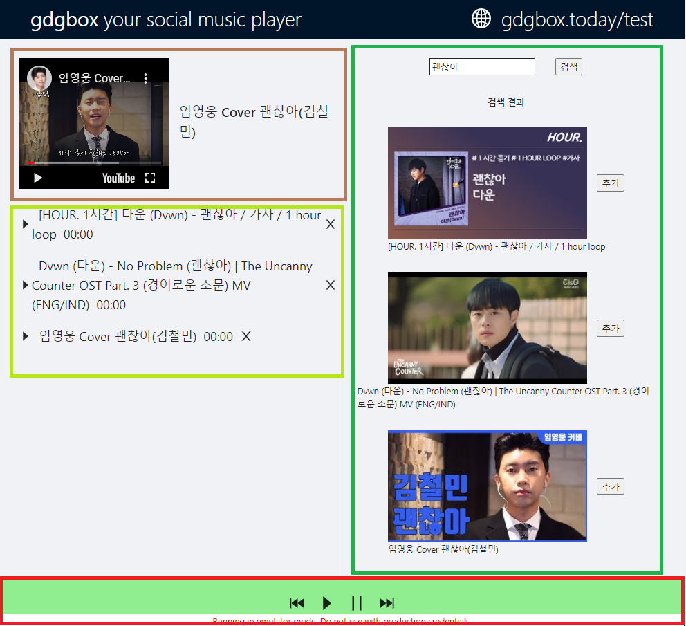

# 리팩토링 및 props 끌어올리기

새로운 기능을 넣기 전에 기존앱을 먼저 리팩토링 해보았다

기존 앱에는 모든 코드가 App.tsx에 작성이 되있었기 때문에

새로운 기능을 넣게 된다면 가독성 및 유지보수성이 심각하게 저하될것이라고 판단하였다

현재 앱의 기능을 보았을때 크게 4구역으로 구분하였다



1. 현재 재생되는 노래의 정보판
2. 노래 큐
3. 노래 검색 및 검색 결과
4. 재생 컨트롤러

그래서 뷰를 우선 4개의 컴포넌트로 나누고  
컴포넌트 안에서 사용되는 기능 및 상태를  
property로 따로 빼내어 상당히 커플링된 부분을
디커플링 하였다

1. 현재 재생되는 노래의 정보판 (PlayerPanel)
```ts
interface Props {
  youtube: ReactElement;
  title: string;
}
const PlayerPanel = (props: Props) => {
  return (
    <div
      css={{
        ...inFlexRow,
        alignItems: 'center',
      }}>
      {/* 유튜브 */}
      {props.youtube}
      <h2 css={{ marginLeft: 16 }}>{props.title}</h2>
    </div>
  );
};
```
특이점이 있다면 유튜브 컴포넌트를 따로 props로 뺏다는것인데
유튜브 API의 player 객체를 상위 컴포넌트에서 다루어야 다른 컴포넌트에서도 해당 player의 기능을  
재사용 할 수 있을 것이라 생각하였다

2. 노래 큐 (PlayerQueue)
3. 노래 검색 및 검색 결과(MusicSearch)  
위 두 컴포넌트는 상태를 끌어올린것 이외에 특이점이 없기 때문에  
내용이 길어지기 때문에 첨부를 하지 않았다

4. 재생 컨트롤러 (MusicController)
```ts
interface Props {
  playMusic: () => void;
  pauseMusic: () => void;
  backwardMusic: () => void;
  forwardMusic: () => void;
}
const MusicController = (props: Props) => {
  return (
    <div
        css={{
          ...
        }}>
        <FastBackwardOutlined
          ...
          onClick={() => {
            props.backwardMusic();
          }}
        />
        <CaretRightOutlined
          ...
          onClick={() => {
            props.playMusic();
          }}
        />
        <PauseOutlined
          ...
          onClick={() => {
            props.pauseMusic();
          }}
        />
        <FastForwardOutlined
          ...
          onClick={() => {
            props.forwardMusic();
          }}
        />
      </div>
  )
}
```

해당 컴포넌트에서는 플레이어에 의존하는 기능(playMusic, backwardMusic, pauseMusic, forwardMusic)을  
props에서 받아오게하여 플레이어에 대한 의존성을 분리하였다

설명을 넘어간 컴포넌트에서도 플레이어에 대한 기능을 상위 컴포넌트에 책임을 위임하였다


# 
