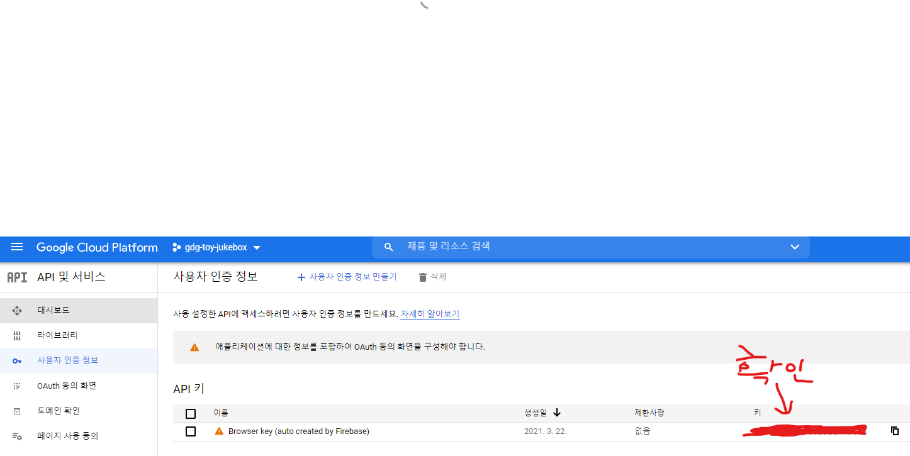
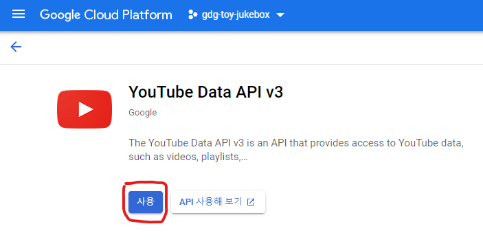
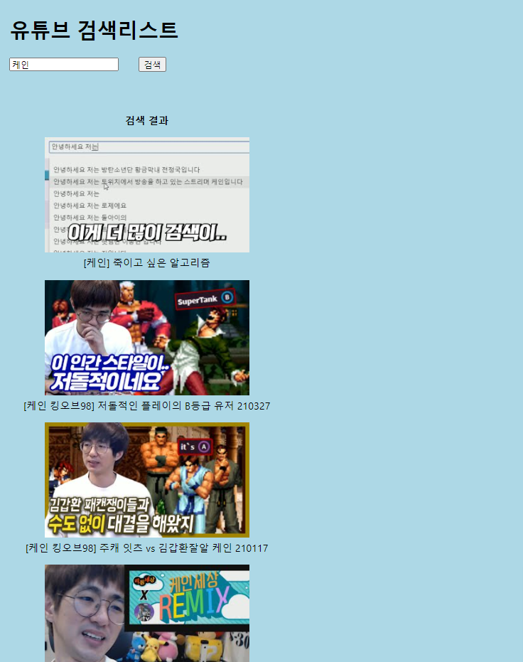

# 유튜브 크롤링

## 유튜브 API 키 확인

유튜브에서 검색어를 통한 영상조회는 Youtube API를 사용해야 가능하다

그전에 API 키를 확인해야지 Youtube API를 사용할 수 있다  
[API 키 확인](https://console.cloud.google.com/apis/credentials?hl=ko)



파이어베이스 프로젝트와 앱을 만들었다면  
위 사진과 같이 자동으로 생성된 앱을 위한 API 키가 나온다

그 다음 [API 라이브러리](https://console.cloud.google.com/apis/library?folder=&hl=ko) 를 접속하여 Youtube API를 사용 설정 해줘야한다



api 테스트 클라이언트 (ex Postman) 에서  
url은 `https://www.googleapis.com/youtube/v3/search`  
query parameter는

```
{
    "key": "(API 키)",
    "part": "snippet",  // 자세한 정보 보는 옵션
    "q": "(검색어)",
    "type": "video",    // 비디오만 검색결과에 나오게 하는 옵션
}
```

로 설정해주어 검색하면

```
{
    "kind": "youtube#searchListResponse",
    "etag": ...,
    "nextPageToken": ...,
    "regionCode": "KR",
    "pageInfo": {
        "totalResults": 422525,
        "resultsPerPage": 5
    },
    "items": [
        {
            "kind": "youtube#searchResult",
            "etag": "weUQWMKjbIFksBl8RMWfnzHwcr8",
            "id": {
                "kind": "youtube#video",
                "videoId": "BNYCEAyOiaU"
            },
            "snippet": {
                "publishedAt": "2021-04-02T08:36:08Z",
                "channelId": "UC0aKwoKNeqBaUwiEXmkQaGQ",
                "title": "[케인] 죽이고 싶은 알고리즘",
                "description": "[케인TV 구독] http://bit.ly/26FP7G0 [케인TV 방송국] https://www.twitch.tv/kanetv8.",
                "thumbnails": {
                    "default": {
                        "url": "https://i.ytimg.com/vi/BNYCEAyOiaU/default.jpg",
                        "width": 120,
                        "height": 90
                    },
                    "medium": {
                        "url": "https://i.ytimg.com/vi/BNYCEAyOiaU/mqdefault.jpg",
                        "width": 320,
                        "height": 180
                    },
                    "high": {
                        "url": "https://i.ytimg.com/vi/BNYCEAyOiaU/hqdefault.jpg",
                        "width": 480,
                        "height": 360
                    }
                },
                "channelTitle": "케인 TV",
                "liveBroadcastContent": "none",
                "publishTime": "2021-04-02T08:36:08Z"
            }
        },
        ...
    ]
}
```

해당 검색 결과가 JSON 형태로 출력된다

이것을 이용하여 React 웹앱에서 리스트로 출력해보겠다

css in js를 통한 스타일링을 위하여 `emotion.js`를 설치 한다  
`npm install --save @emotion/react`

또한 이 라이브러리를 사용하려면 매 소스파일 상단에  
`/** @jsxImportSource @emotion/react */`  
전처리기를 추가해주어야 작동한다

그리고 스타일을 사용하기 위해 개별 css파일이나 컴포넌트를 만들 필요없이  
어떤 컴포넌트, 엘리먼트에든 `css` 라는 이름의 프로퍼티에  
객체 스타일로 css스타일을 지정하면 스타일이 지정된다

웹앱 프로젝트로 돌아와서 기존에 있던 App.tsx 의 내용물을 지워주고  
아까전 api 테스터에서 사용했던 uri을 이용하여 간단한 검색 시스템을 만들어 보았다

(중요하지 않은 부분은 생략하였다)

```js
const QUERY_URL =
  'https://www.googleapis.com/youtube/v3/search?key=(API key)&part=snippet&type=video&q=';

function App() {
  const [resultItems, setResultItems] = useState<YoutubeItem[]>();
  const [searchWord, setSearchWord] = useState('');

  async function reqGetSearchResult() {
    if (searchWord === '') return;

    const raw = await (await fetch(QUERY_URL + searchWord)).json();
    setResultItems(raw.items as YoutubeItem[]);
    console.log(raw.items as YoutubeItem[]);
  }

  const renderedYoutubeList =
    resultItems &&
    resultItems.map((item) => {
      return (
        <p key={item.id.videoId}>
          
          <br />
          {item.snippet.title}
        </p>
      );
    });

  return (
    <div
      className="App"
      css={{
        display: 'flex',
        flexDirection: 'column',
        alignItems: 'flex-start',
        minHeight: '100vh',
        backgroundColor: 'lightblue',
        padding: 16,
      }}>
      <h1>유튜브 검색리스트</h1>

      <div
        css={{
          display: 'flex',
          flexDirection: 'row',
          alignItems: 'center',
          justifyContent: 'center',
        }}>
        <input
          type="text"
          onChange={(e) => {
            const tmp = e.target.value.trim();
            setSearchWord(tmp);
          }}
        />
        <button css={{ marginLeft: 32 }} onClick={() => reqGetSearchResult()}>
          검색
        </button>
      </div>

      <p
        css={{
          marginTop: 64,
        }}>
        {renderedYoutubeList && <strong>검색 결과</strong>}
        {renderedYoutubeList}
      </p>
    </div>
  );
}
```

위 컴포넌트의 출력화면이다  


검색결과에 따라 썸네일과 제목이 잘 뜨는것을 확인할 수 있다

