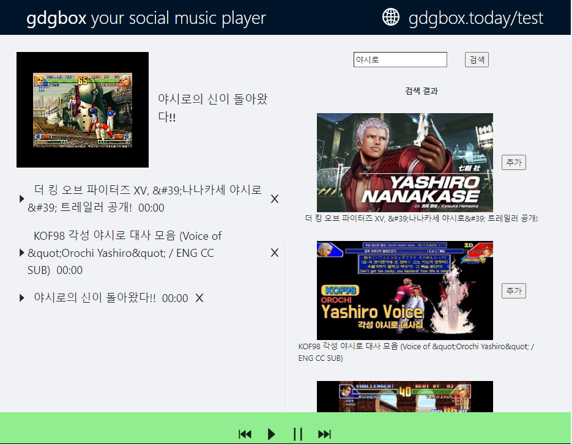

# Youtube Player API 적용

[링크](https://developers.google.com/youtube/iframe_api_reference#Playback_controls)

위 링크에서 Youtube Player API에 대한 레퍼런스를 참고하여 진행하려다  
리액트 컴포넌트로 래핑된 
react-youtube 라는 라이브러리를 사용하였다

유튜브 재생 API가 컴포넌트로 추상화되있는 편이 유지보수성이 더 나은것 같아 진행하였다

```js
<YouTube
  videoId={string}                  // defaults -> null
  id={string}                       // defaults -> null
  className={string}                // defaults -> null
  containerClassName={string}       // defaults -> ''
  opts={obj}                        // defaults -> {}
  onReady={func}                    // defaults -> noop
  onPlay={func}                     // defaults -> noop
  onPause={func}                    // defaults -> noop
  onEnd={func}                      // defaults -> noop
  onError={func}                    // defaults -> noop
  onStateChange={func}              // defaults -> noop
  onPlaybackRateChange={func}       // defaults -> noop
  onPlaybackQualityChange={func}    // defaults -> noop
/>
```

위의 videoId prop에 Search API에서 받아온 videoId를 주입하여 실행하였고

플레이어 컨트롤에 대해서는
플레이어 객체를 얻어야지만 가능하기 때문에   useRef를 사용하여 플레이어 객체를 얻었다


```
export default class YouTube extends React.Component<YouTubeProps> {
  static PlayerState: {
    UNSTARTED: number;
    ENDED: number;
    PLAYING: number;
    PAUSED: number;
    BUFFERING: number;
    CUED: number;
  };
  getInternalPlayer(): YouTubePlayer;
}

```

라이브러리 컴포넌트의 선언에 이렇게 되있기 때문에

getInternalPlayer() 메소드로 플레이어에 접근하였다

```js
const ref = useRef<Youtube>(null);
const player = ref.current.getInternalPlayer();

...

<Youtube ref={ref} ...>
```

현재 플레이어 컨트롤과 재생 큐 기능을 포함하여 개발을 완료하였다


